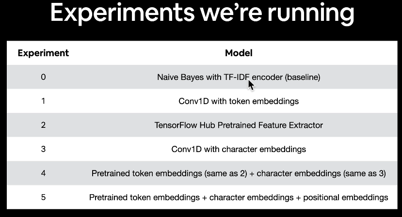
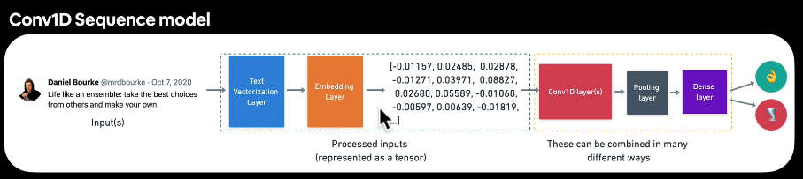

# MileStoneProject_SkimLit
My side-project about building a natural language processing model for multi purpose.

- **Tokenization**: The process of converting text into smaller units, called tokens, which can be words, subwords, or characters. This is a crucial step in preparing text data for machine learning models (can be modelled but quickly ges too large).
- - **Text Vectorization**: The process of converting text data into numerical vectors that can be processed by machine learning algorithms. This often involves techniques like one-hot encoding, TF-IDF, or word embeddings (can limit size).

- **Embedding**: A technique used to represent words or phrases as dense vectors in a continuous vector space. Embeddings capture semantic relationships between words, allowing models to understand context and meaning (can limit size and can be learned)

